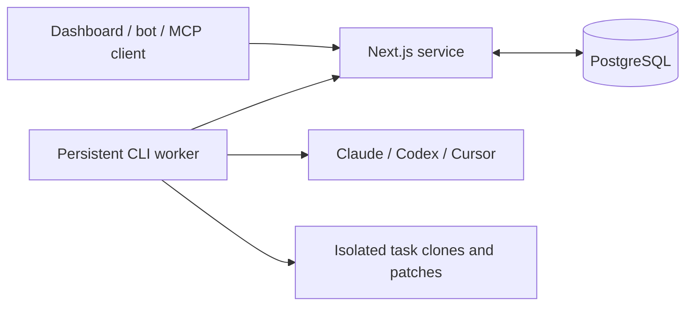

# LLM Usage

Self-hosted subscription usage monitoring and coding-task orchestration for Claude Code, Codex and Cursor. Connect each provider once in the dashboard; the service then reads remaining allowance and reset times live from the providers on every view, routes work with an explainable planner, and submits repository tasks through MCP or HTTP. Workers receive short-lived access tokens from the service, run the providers' CLIs and return patches for review.

This is a **single-owner system**, not a multi-user hosted service. Each operator deploys their own instance and authorizes their own provider accounts. CLI execution and telemetry depend on the provider's current authentication, subscription and endpoint behavior.

## Start here

**[Deploy your own dashboard on Vercel](docs/deploy-your-own.md)** — fork, generate private configuration, deploy, and connect your own subscription accounts. Give your setup agent [AGENTS.md](AGENTS.md).

- **Try it without provider accounts:** [local demo](docs/getting-started.md#local-demo).
- **Run real coding tasks:** [connect a worker](docs/getting-started.md#connect-a-real-worker), then [submit your first task](docs/getting-started.md#submit-your-first-task).
- **Host it continuously:** [deployment and operations](docs/deployment.md).
- **Connect a bot or assistant:** [MCP and REST](docs/execution.md#mcp-and-rest).

Requirements: Node.js 22, pnpm **11.19.0**, PostgreSQL (validated with 17), Git, and a persistent Mac or Linux machine for real workers. Provider accounts are unnecessary for the mock demo. Docker, Vercel, Tailscale and 1Password are optional.

## What runs where



The web service owns provider sessions (encrypted), live usage reads, routing and the job queue. Workers own execution only: they fetch access tokens from the service before each check and task. A worker may run on a cloud VM: `execution: local` means a CLI running on that worker, not necessarily on your laptop. `execution: cloud` means a provider-hosted coding environment.

| Capability | Current support |
| --- | --- |
| Usage dashboard | Password protected, phone-friendly; every view reads the providers live (20-second shared window); display timezone is Eastern Time |
| Quotas and resets | Claude, Codex and Cursor authenticated telemetry read by the service from its own provider sessions, with freshness and diagnostics |
| Provider sign-in | Once per provider at `/connect`; workers never log in themselves |
| Worker CLI execution | Claude, Codex and Cursor |
| Provider-hosted execution | Codex adapter; requires your configured provider environment and repository |
| MCP | Authenticated Streamable HTTP at `/mcp`; configurable bearer headers required, no OAuth discovery |
| Results | Git patches and job status; no automatic PR creation or deployment |
| Paid API fallback | Not implemented; unavailable subscription capacity does not authorize paid usage |

Provider telemetry endpoints are not guaranteed public APIs. Unknown capacity stays unknown; provider behavior and a real-machine acceptance test determine readiness. See [provider support](docs/providers.md) and [execution limitations](docs/execution.md#runtime-and-results).

## Repository layout

| Path | Purpose |
| --- | --- |
| `apps/web` | Dashboard, usage API, execution API and MCP server |
| `collector` | Worker: official CLI execution with service-issued access tokens |
| `packages/providers` | Provider enrollment, refresh, live usage readers and CLI credential formats |
| `packages/core` | Validated contracts and routing logic |
| `packages/db` | PostgreSQL schema and ordered migrations |
| `config` | Nonsecret configuration examples; replace all placeholder paths |
| `scripts` | Operator verification helpers |

The optional companion [ai-builder-tools setup pack](https://github.com/dnikolsk/ai-builder-tools/tree/feat/cloud-subscription-workers/machine) installs tools and configures host supervision/1Password. It delegates worker configuration to this repository. That setup currently lives on `feat/cloud-subscription-workers`; if you cannot access it, the manual worker instructions here work independently. Neither repository copies provider sessions between machines.

## Development and contribution

```sh
pnpm install --frozen-lockfile
pnpm lint
pnpm typecheck
pnpm test
pnpm build
node --test scripts/verify-execution.test.mjs
```

The database integration suite is opt-in; [setup and validation](docs/getting-started.md#development-checks) explains how to run it. Fixture tests do not establish live provider authentication. Read [AGENTS.md](AGENTS.md) and [security](docs/security.md) before contributing. Use a feature branch and a PR describing behavior and validation; never commit credentials, provider profiles or real task artifacts.

Further reference: [architecture](docs/architecture.md), [execution and routing](docs/execution.md), [usage-only routing](docs/routing.md), and [usage API OpenAPI](openapi/openapi.yaml). The OpenAPI file covers `/v1/status`, `/v1/route` and `/v1/ingest`; execution/MCP are documented separately.
