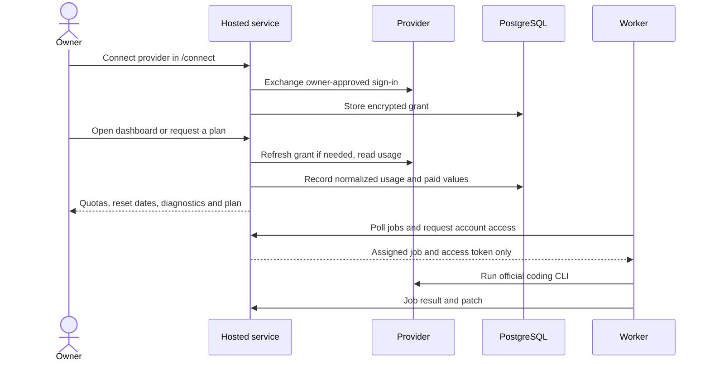

# Architecture

Owner enrolls each provider once at `/connect` → the service stores the grant sealed with `LLM_SESSION_KEY` → every read (dashboard, `/v1/status`, MCP `list_accounts`/`plan_task`) calls the providers live, appends the observation to Postgres, and projects status → deterministic `/v1/route` and execution planning → clients. Workers fetch short-lived access tokens from the service, run the official CLIs, and return patches.

Usage monitoring works with the worker offline. Coding execution needs a running worker and its registered targets. Vercel hosts request handlers; it does not keep CLI worker processes running.

The execution layer adds MCP/HTTP task submission, a durable queue, staged provider/account/target selection, and cloud-hosted official CLI workers. See [execution.md](execution.md). The original `/v1/route` remains a quota-only recommendation contract; `/v1/execution/plan` considers live worker health, billing, setup and existing sessions as well as quota.

Account IDs are stable across snapshots and providers may have many accounts. Each live read writes a complete observation, including `partial` and `error` observations; reads within a 20-second window reuse the latest one instead of calling the provider again. The status API returns the most recent *successful* (`ok` or `partial`) buckets alongside the latest health result and observed time. On failure, old capacity remains visible but freshness is based on the successful observation, and routing rejects error state. Snapshot IDs and idempotency keys are unique; recording the same reading twice cannot duplicate historical observations. `/v1/ingest` is retired (`410`) except for the local demo's simulated observations: pushed snapshots would only overwrite live readings with stale ones.

Bucket `reset_at` is kept as reported. Past resets make a bucket unusable for routing until a fresh observation arrives. Every timestamp in storage and JSON is UTC. The UI formats reset dates and countdowns at render time in Eastern Time. Router freshness defaults to ten minutes; after sixty minutes status is `seriously_stale`. Buckets without a measured fraction are visible but ineligible for routing.

`GET /v1/status` may refresh grants and write new observations. `GET /v1/status?fresh=0` reads the stored projection without calling providers. Diagnose the service and its observation metadata first; a worker diagnostic cannot establish whether the service can read its own provider grants. See [troubleshooting](troubleshooting.md).

Provider grants are the most sensitive data the service holds; see [security.md](security.md). Role tokens are personal deployment credentials and must be independent random secrets. A future multi-user release needs scoped identities, audit logs, token rotation, and account ownership checks. Provider browser cookies and HTML are never imported into the service; the owner completes sign-in through the provider’s authorization flow.
