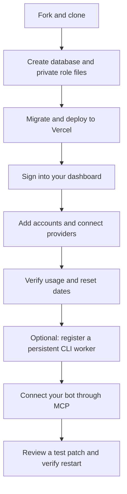

# Deploy your own

Deploy your own password-protected dashboard and MCP service at a new `*.vercel.app` address. You own the GitHub fork, database, hosting secrets and connected subscriptions. This is a single-owner application; other people should deploy their own copy.

**Start with the dashboard (steps 1–5). Add a worker only when you want coding tasks (steps 6–7).** Usage monitoring does not require an unlocked Mac, Tailscale, 1Password or a running worker.



## Before you start

| You need | Used for |
| --- | --- |
| GitHub and Vercel accounts | Your fork and hosted service; hosting charges follow your plans |
| Empty PostgreSQL database, such as Neon | Accounts, encrypted provider grants, usage and jobs; PostgreSQL 17 is validated |
| A setup machine with Git, Node.js 22 and pnpm 11.19.0 | Install dependencies, generate secrets and run migrations |
| Your Claude, ChatGPT/Codex, Cursor and/or Gemini accounts | Approve each provider from your own browser, including on a phone |
| Optional persistent Mac/Linux host | Run official coding CLIs and accept jobs; Vercel cannot host this process |

An agent can do the setup. Give it this prompt:

> Read AGENTS.md and docs/deploy-your-own.md. Set up my own hosted instance using my own resources and existing authorization. Generate and bind secrets securely; never print them in chat. Deploy and verify dashboard access, then send me to my dashboard’s /connect to approve my provider accounts. For coding tasks, prepare a persistent worker and MCP connection, verify a reviewed patch, and repeat after an idle restart. Report what is verified and what needs my action. Do not reuse the original author's hosting or accounts.

The owner approves hosting access and provider sign-in. The agent handles configuration, migrations, deployment, registration and checks within the authorized scope. Already running an older release? Use the [upgrade runbook](../AGENTS.md#upgrade-an-existing-instance-to-live-provider-sessions).

## 1. Fork, clone and install

Install [Node.js 22](https://nodejs.org/en/download) if needed, then install the pinned package manager with `npm install --global pnpm@11.19.0` (or use your existing version manager).

[Fork this repository](https://github.com/dnikolsk/llm-usage/fork), then replace `YOUR_GITHUB_NAME` below:

```sh
git clone https://github.com/YOUR_GITHUB_NAME/llm-usage.git
cd llm-usage
node --version
pnpm --version
pnpm install --frozen-lockfile
```

Expect Node 22 and pnpm 11.19.0. Install these versions before continuing if they are missing. Run subsequent commands from this repository root. Use Bash or Zsh. Placeholder paths and URLs must be replaced with your own.

## 2. Create the database and private configuration

Create an empty PostgreSQL database with your hosting provider. Obtain its connection URI from protected settings; do not paste it in chat. Preview deployments must have separate databases and secrets.

```sh
pnpm setup:init --directory "$HOME/.llm-usage-owner" --worker-id worker-1
```

This creates a new mode-700 directory with mode-600 JSON files. It generates independent role secrets and the 64-hex `LLM_SESSION_KEY`, reuses valid injected bindings, and refuses to overwrite existing setup files. It does not provision resources or deploy anything.

If `DATABASE_URL` was securely injected into the setup process, it is included. Otherwise the helper reports `database_configured: false`. Using a trusted local editor or secret-management tool, add `DATABASE_URL` inside the `variables` object of **both** `web-secrets.json` and `operator-secrets.json`. Use the provider's full PostgreSQL URI and TLS settings. `setup.json` records the initial generation state; successful migration is the actual database check.

| File | Who receives it |
| --- | --- |
| `web-secrets.json` | Hosted service: database, encryption key and role bindings |
| `operator-secrets.json` | Temporary migration/registration process: database and admin token |
| `worker-secrets.json` | This worker: only its machine-specific token |
| `client-secrets.json` | Bot/client: job and read tokens |
| `setup.json` | Nonsecret setup metadata |

Keep the bundle outside Git and back it up securely. Losing or replacing `LLM_SESSION_KEY` makes existing provider grants unreadable and requires reconnecting the accounts. 1Password or another secret store is optional; see [credential placement](deployment.md#configuration-and-credential-placement).

**Checkpoint:** the private files exist, and web/operator roles have the same destination `DATABASE_URL`. Do not print their values to check this.

## 3. Configure Vercel and migrate

Open [Vercel's import page](https://vercel.com/new) and import your fork:

| Vercel setting | Value |
| --- | --- |
| Framework | Next.js |
| Root Directory | `apps/web` |
| Node.js | 22.x |
| Install/build | Use the repository's pnpm workspace/lockfile and Next.js defaults |
| Files outside Root Directory | Allow workspace dependencies when the setting is shown |
| Production environment variables | Bind the keys from `web-secrets.json` → `variables` |

Through authorized hosting tools or Vercel's protected settings, enter each variable separately; do not upload the entire JSON as one variable. Do not use `NEXT_PUBLIC_*`. The web role includes `DATABASE_URL`, `LLM_SESSION_KEY`, `DASHBOARD_PASSWORD`, `READ_TOKEN`, `WRITE_TOKEN`, `JOB_TOKEN`, `ADMIN_TOKEN` and `WORKER_WORKER_1_TOKEN`. `WRITE_TOKEN` is retained for the local demo; real usage is collected by the service.

Before validating deployment, run all migrations against your destination database:

```sh
pnpm setup:run --file "$HOME/.llm-usage-owner/operator-secrets.json" -- pnpm db:migrate
```

Expect `Migration applied`. Do **not** seed demo accounts into production. The role wrapper supplies only the selected role plus basic OS/network settings; unrelated inherited credentials are excluded. It is not a security sandbox.

## 4. Deploy and sign in

Deploy the Vercel project. Redeploy whenever its environment variables change. Open the assigned HTTPS URL and sign in with your generated `DASHBOARD_PASSWORD`, retrieved privately from your secret store.

**Checkpoint:** the password-protected dashboard loads. An empty account list is expected. A successful build alone does not prove database or provider access. For deployment errors, see [troubleshooting](troubleshooting.md) and [other Node hosting](deployment.md#other-node-hosts).

## 5. Add and connect your accounts

Open `/connect` on your new dashboard. Expand **Add an account**. Choose each provider, a label and personal/work scope. Use these IDs if you want the worker generator's defaults later:

| Account | Provider selection | Suggested account ID | What you do after opening sign-in |
| --- | --- | --- | --- |
| Claude | Claude | `claude-personal` | Approve and paste the displayed code back into `/connect` |
| ChatGPT | Codex | `chatgpt-personal` | Approve and copy the full localhost redirect address from the address bar back into `/connect`; that address may not load a page |
| Cursor | Cursor | `cursor-personal` | Approve, then return and choose **I signed in — continue** |
| Google | Gemini | `google-ai-pro-personal` | Follow the page instructions and paste the displayed code |

Complete one account at a time in the same browser before the ten-minute attempt expires. Paste codes/redirect URLs only into your dashboard, never into chat. No browser on the worker machine is needed. Subscription sign-in does not use Anthropic/OpenAI/Cursor API keys.

An account should say **Connected** on `/connect` and **Live** on the dashboard. The service stores the encrypted grant, refreshes it when needed and reads usage on dashboard/API/MCP requests. Readings within 20 seconds are shared. No usage cron job is needed.

**Checkpoint:** compare each requested account's usage with its provider's own screen. Expand all windows to check resets. UI dates are Eastern Time; API dates are UTC. A null reset or paid amount can be valid: [interpret the fields](providers.md#what-the-dashboard-numbers-mean). A Live badge indicates a connected session, so also check observation timestamps and diagnostics. You now have a hosted usage dashboard; stop here if that is all you need.

## 6. Add a coding worker

On a persistent Mac/Linux host, follow [Connect a real worker](getting-started.md#connect-a-real-worker) to install official CLIs, prepare repository checkouts and create `worker.json`. Use your Vercel HTTPS origin and `worker-1`. For a first installation with only one provider, copying and trimming the example config is simpler than the generator, which requires paths for Claude, Codex and Cursor.

Keep the `account_id` values exactly equal to those you connected in step 5. One real login gets one stable account ID across all workers. Each worker gets a distinct worker ID and token. Confirm provider included allowance and overage settings before changing a target's `billing` from `unknown` to `subscription`.

From a trusted checkout with access to the config, register using the operator role:

```sh
pnpm setup:run --file "$HOME/.llm-usage-owner/operator-secrets.json" -- \
  pnpm --filter @llm-usage/collector register /absolute/path/worker-state/worker.json
```

Start the worker on its host with only its worker role:

```sh
pnpm setup:run --file /absolute/private/path/worker-secrets.json -- \
  pnpm --filter @llm-usage/collector worker /absolute/path/worker-state/worker.json
```

Transfer/bind only that worker's token to a remote host, not the entire owner bundle. The worker fetches access tokens from the service and writes CLI credential files; do not run separate CLI logins for this managed worker. Run exactly one process per worker ID under your host supervisor. The optional [machine setup pack](https://github.com/dnikolsk/ai-builder-tools/tree/feat/cloud-subscription-workers/machine) supplies supervision helpers; [manual setup](getting-started.md#connect-a-real-worker) works independently.

Tailscale is optional for SSH/private networking. A worker can poll a public authenticated Vercel service over outbound HTTPS without an inbound port. 1Password can supply the worker token, but needs host authorization itself; neither tool replaces the provider connection flow.

**Checkpoint:** connected accounts show **Worker online**, and execution plans select an eligible target for your repository. A cloud VM running a CLI is `execution: local`; `execution: cloud` means a provider-hosted environment, currently implemented only for configured Codex targets.

## 7. Verify a task and connect your bot

From a client environment with access to the nonsecret worker config, replace `my-project` with its registered repository key:

```sh
pnpm setup:run --file "$HOME/.llm-usage-owner/client-secrets.json" -- \
  node scripts/verify-execution.mjs /absolute/path/worker-state/worker.json \
  /absolute/private/path/first-check --repository my-project
```

This plans without submitting a coding task; it can refresh live usage. Inspect exclusions if no target is eligible. Repeat with `--run` to consume subscription allowance and create a small test file in an isolated clone. Review the returned patch. Use the same output directory to resume an interrupted attempt; use a **new** output directory after an idle worker restart to verify a second task without re-login. The helper tests automatic execution and plans explicit Claude/Codex/Cursor routes; it does not prove every provider executes. For that, [submit a small explicit-provider task](getting-started.md#submit-your-first-task) for each requested provider.

Configure a bearer-header-compatible Streamable HTTP MCP client:

| Setting | Value |
| --- | --- |
| URL | `https://YOUR_VERCEL_PROJECT.vercel.app/mcp` |
| Authorization header | `Bearer <your JOB_TOKEN>`, inserted through client secret settings |
| First tools | `list_accounts`, then `plan_task` |
| Execution tools | `submit_task`, `get_task`, `cancel_task` |

The dashboard password does not authenticate MCP. OAuth discovery is not implemented. For browser clients, configure the exact `MCP_ALLOWED_ORIGINS` if needed; see [MCP reference](execution.md#mcp-and-rest).

**Done when:** your dashboard works, each requested provider's live data is checked, a task returns the expected patch, and a new task succeeds after an idle worker restart. Builds, account registration and a connected badge alone do not prove task readiness. Keep the deployment URL, release commit, worker ID and verification results in your private operations notes; keep secrets out of the report.
