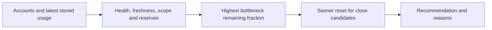

# Usage-only routing (`/v1/route`)

Filter enabled accounts, capability/model class, health, freshness, bucket exhaustion, reserves, and buckets whose reset has already passed. Among eligible accounts, maximize the smallest applicable remaining fraction above its reserve. If capacities are within five percentage points, prefer the account with a sooner reset within two hours; priority breaks further ties. Return every candidate's eligibility and inputs. Unknown measured capacity is not eligible; an account without a bucket for a requested model scope may not claim capacity for it.

Paid budgets/credits are excluded. A missing reset is not a new rolling window; a passed reset is not proof that capacity replenished. Use `/v1/status` to trigger current observations before relying on the stored quota-only route.

This is the original usage API recommendation policy. Coding tasks use the separate staged [execution planner](execution.md#step-by-step-decision), which also considers worker health, repository/setup readiness, billing and continuation.
