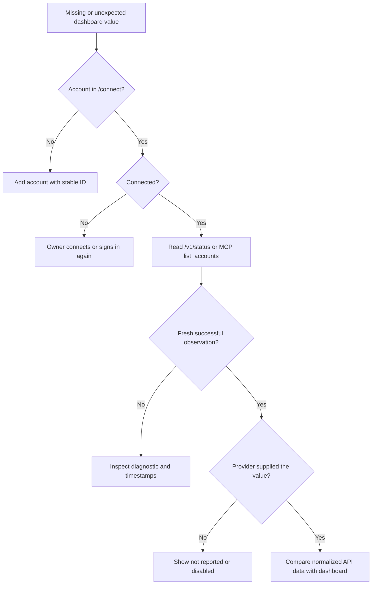

# Diagnose missing usage, dates or credits

Start at your hosted service. It holds encrypted provider sessions and collects usage; workers execute tasks. A missing field does not by itself mean a worker, Tailscale or a collector needs repair.



## 1. Confirm the release and the service

Record the checkout's `git rev-parse HEAD`, the deployed commit shown by your host, and the dashboard origin. Different releases or databases can produce different results. Never assume a worker's checkout is the deployed web release.

`usage:doctor`, `usage:sync` and `usage_mirror` belong to the retired publisher architecture. Current `main` has no `usage:doctor` script. `ERR_PNPM_RECURSIVE_RUN_NO_SCRIPT` means the command is unavailable: it did not diagnose provider data, and it did not change the worker. Do not keep rerunning it or reinstall old collectors. Use the service checks below.

## 2. Check the account and observation

At `/connect`, verify the account ID and **Connected** state. A new connection requires the owner's browser approval. Missing `LLM_SESSION_KEY` requires a server setting and redeploy; do not replace an existing key as a troubleshooting experiment.

From a trusted client shell, inject `READ_TOKEN` through secret settings, then use your own HTTPS origin:

```sh
export SERVICE_URL=https://YOUR_VERCEL_PROJECT.vercel.app
curl --fail-with-body -H "Authorization: Bearer $READ_TOKEN" \
  "$SERVICE_URL/v1/status?fresh=0"
curl --fail-with-body -H "Authorization: Bearer $READ_TOKEN" \
  "$SERVICE_URL/v1/status"
```

The first request reads stored observations only. The second contacts providers when the shared 20-second window has expired, may refresh grants, and saves observations. Neither submits a coding task. MCP `list_accounts` also reads live usage using `JOB_TOKEN`.

Inspect these normalized fields locally; redact account identities before sharing a report:

| Field | Meaning |
| --- | --- |
| `generated_at` | Time the response was assembled, not necessarily a new provider reading |
| `observations` | Per-account live attempt outcomes; absent on `fresh=0` |
| `accounts[].status`, `usage_diagnostic` | Latest collection health and diagnostic |
| `observed_at` | Last successful usage observation |
| `latest_refresh_at` | Latest observation, including failure |
| `limits[].id`, `scope`, `remaining_fraction`, `reset_at` | Included usage and each window's own UTC reset |
| `paid_usage`, `paid_usage_diagnostic` | Separate paid amounts, units, enabled state and parsing diagnostic |

An `observed` outcome means an observation was recorded; it may still be partial or have a diagnostic. `cached` can reuse a recent failed reading, so inspect account health too. A null outcome diagnostic or a **Live** badge alone does not prove fresh, complete quota. After a failed read, the API can retain older successful values; do not mistake them for current balances.

## 3. Interpret nulls and units correctly

- **Claude resets:** five-hour and seven-day resets are independent. The provider may report no five-hour reset while idle. Preserve null instead of borrowing the weekly reset or adding five hours to the current time.
- **Claude extra usage:** `enabled: false` means disabled. Null used/limit/remaining amounts do not establish a zero prepaid balance.
- **Codex:** a paid balance is in provider credits, not dollars or tokens.
- **Cursor:** on-demand used/limit values describe spending, not a prepaid wallet. The provider may omit the remaining amount. Spend can exceed the reported limit; preserve those reported values for inspection.
- **All providers:** `0` is a reported or documented derived amount; null is unknown. Paid values never expand the planner's included allowance. Separate API-account balances are outside this dashboard.

See [provider field meanings](providers.md#what-the-dashboard-numbers-mean). Compare the same account, usage window and timezone against the provider screen. A passed reset or a stale/failed observation requires a new successful reading before claiming replenished capacity.

## 4. Act on the diagnostic

| Evidence | Next action |
| --- | --- |
| `usage_auth_required` / Sign in again | Reconnect that account at `/connect`; never send the code in chat |
| `usage_rate_limited` | Respect provider retry guidance and retry later; avoid rapid polling |
| `usage_schema_unrecognized` | Investigate the service-side adapter in `packages/providers`; do not invent quota |
| `paid_usage_schema_unrecognized` | Investigate paid parsing independently; included usage can still be valid |
| API has fresh dates/amounts but dashboard does not | Confirm same origin, deployed commit and account ID; inspect rendering and freshness rules |
| All observations unavailable | Check service database access, migrations and protected secret bindings |
| Usage works but jobs do not | Check worker token/ID, target billing, repository allowlist, model mapping and plan exclusions |

A useful bug report contains release/deployment IDs, timestamps, safe diagnostic codes, affected normalized fields and expected provider-screen values. Exclude tokens, cookies, authorization/redirect URLs, provider response bodies, `.env` contents, sealed grants and repository code. Do not send a full database dump.
